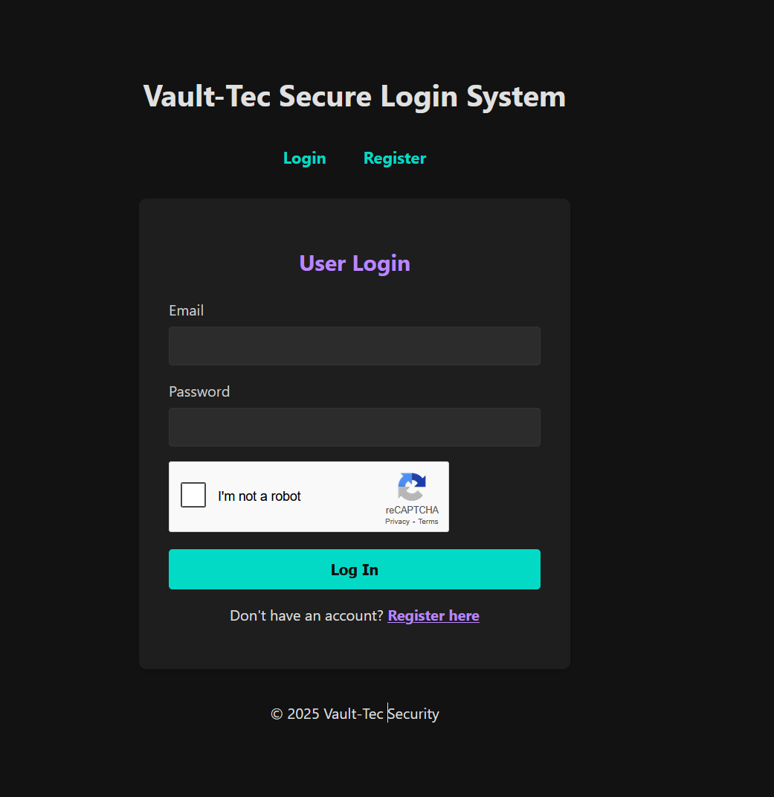
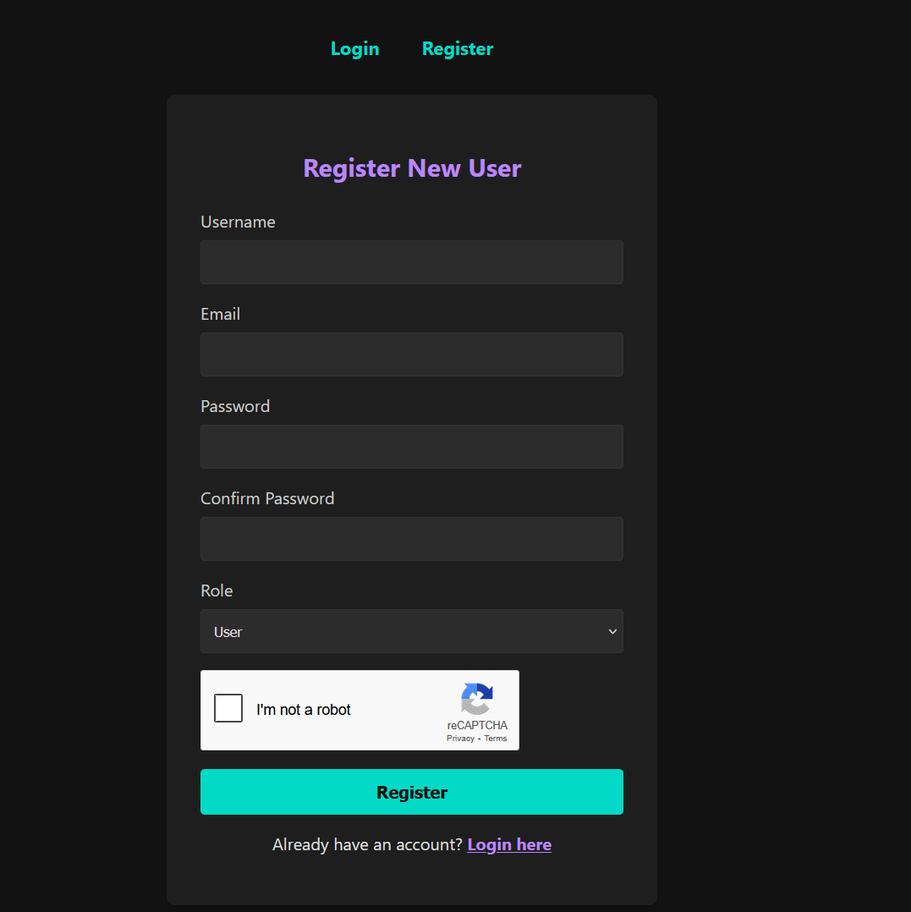
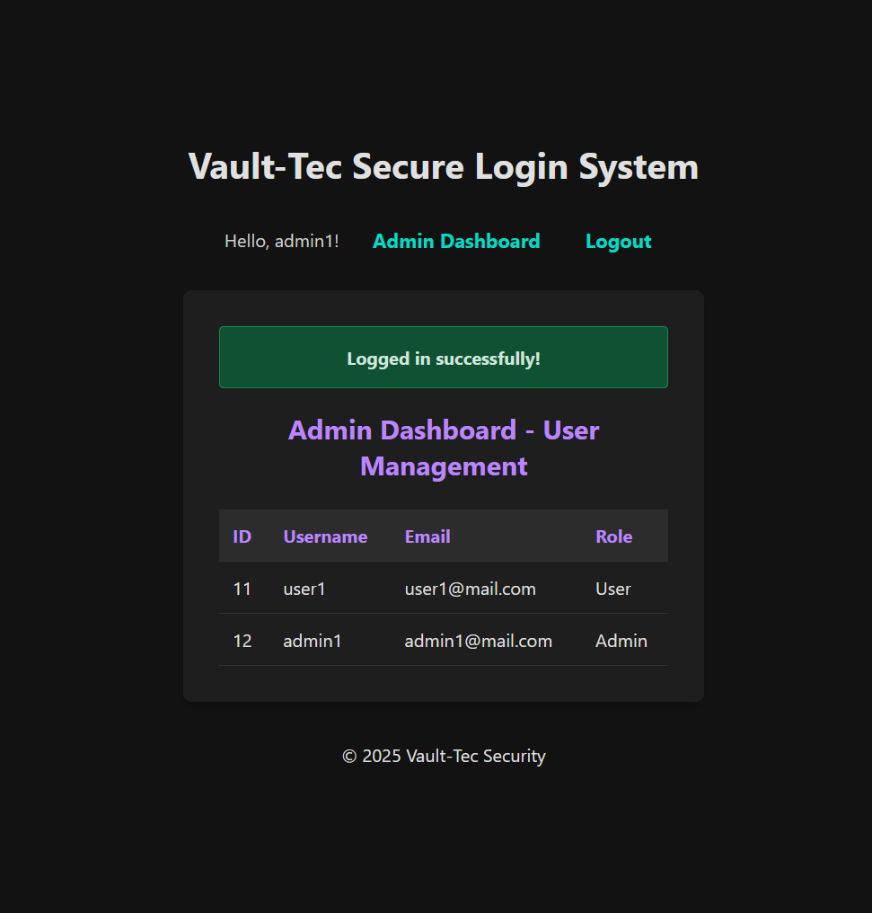

# Vault-Tec Secure Login & RBAC System

## 🚀 Project Overview

This project is a secure web application developed as part of the Vault-Tec Security internship program. It features a complete user authentication and management system built with Python and Flask, demonstrating key cybersecurity principles in a practical setting. The application includes user registration, secure login, role-based access control (RBAC) for distinguishing between regular users and administrators, and various security hardening measures.

---

## ✨ Features

* **User Registration:** New users can register with a username, email, and password.
* **Secure Authentication:** User login is protected with password hashing and verification using the modern **Argon2** algorithm.
* **Role-Based Access Control (RBAC):** Users can be registered as either 'User' or 'Admin'.
* **Admin Dashboard:** A special dashboard, accessible only to Admins, that displays a list of all registered users in the system.
* **Security Hardening:**
    * **reCAPTCHA:** Protects login and registration forms from automated bots.
    * **Account Lockout:** Temporarily locks an account after 5 consecutive failed login attempts to prevent brute-force attacks.
    * **CSRF Protection:** All forms are protected against Cross-Site Request Forgery via Flask-WTF.
    * **SQL Injection Protection:** The use of the SQLAlchemy ORM protects all database queries from SQL injection.

---

## 🛠️ Technology Stack

* **Backend:** Python, Flask
* **Database:** PostgreSQL
* **ORM:** SQLAlchemy, Flask-Migrate
* **Authentication:** Flask-Login
* **Forms & Security:** Flask-WTF (for forms, reCAPTCHA, and CSRF protection)
* **Password Hashing:** Argon2 (`argon2-cffi`)
* **Frontend:** HTML, CSS

---

## ⚙️ Setup and Installation

To run this project locally, follow these steps:

1.  **Clone the repository (replace `your-username` with your actual GitHub username):**
    ```bash
    git clone [https://github.com/your-username/vault-tec-secure-login.git](https://github.com/your-username/vault-tec-secure-login.git)
    cd vault-tec-secure-login
    ```

2.  **Create and activate a virtual environment:**
    ```bash
    # On Windows:
    python -m venv venv
    .\venv\Scripts\activate
    ```

3.  **Install dependencies:**
    ```bash
    pip install -r requirements.txt
    ```

4.  **Set up the database:**
    * Ensure you have PostgreSQL installed and running.
    * Create a new user and database using `psql` or another tool, and grant the user privileges on the new database.

5.  **Configure environment variables:**
    * Create a `.env` file in the project root by copying the example file:
        ```bash
        copy .env.example .env
        ```
    * Edit the `.env` file with your database credentials and reCAPTCHA keys.

6.  **Apply database migrations:**
    ```bash
    flask db upgrade
    ```

7.  **Run the application:**
    ```bash
    python run.py
    ```

---

## 📸 Screenshots

### Login Page


### Registration Page


### Admin Dashboard


### Account Lockout Notification


---

## 🧠 Challenges and Solutions

### Resolving Critical Import Errors
During the initial backend setup, the application frequently crashed with `ImportError` and `ModuleNotFoundError` related to the configuration file. The traceback revealed that Python was attempting to import from files within the `venv` (virtual environment) directory instead of the project's root `config.py` file.

* **Cause:** The chosen filenames (`config.py` and later `settings.py`) were generic and conflicted with internal files used by Python's virtual environment.
* **Solution:** The issue was permanently resolved by renaming the configuration file to a more unique, project-specific name: `project_config.py`. This eliminated the name collision and ensured that the application always imported the correct settings.

### Correcting Database Permissions in PostgreSQL
When first attempting to create the database tables with the `db.create_all()` command, the application failed with a `psycopg2.errors.InsufficientPrivilege` error. The error message "permission denied for schema public" indicated that the application's database user could connect to the database but could not create tables.

* **Cause:** The initial `GRANT ALL PRIVILEGES ON DATABASE...` command only provides connection rights, not rights to modify the schemas within the database.
* **Solution:** I logged into `psql` as a superuser, connected to the project's database (`\c vault_db`), and executed `GRANT ALL ON SCHEMA public TO vault_user;`. This explicitly granted the necessary permissions for the user to create, modify, and delete tables.

### Handling Data Integrity After Schema Migrations
After adding the account lockout feature, the application would crash with a `TypeError` when an existing user had a failed login attempt. The error (`unsupported operand type(s) for +=: 'NoneType' and 'int'`) occurred because the code tried to add `1` to a `None` value.

* **Cause:** The user being tested had been created *before* the `failed_login_attempts` column was added. The database migration added the column but set its value to `NULL` for existing records. The application's model default of `0` only applied to newly created users.
* **Solution:** The immediate fix was to clear the database and test with fresh users who were created with the correct default data. This highlighted the critical importance of writing migration scripts that can handle default values for existing rows in a real-world application.

### Fixing a Hardcoded Role Assignment Bug
During end-to-end testing, the Role-Based Access Control (RBAC) feature failed. Registering a user with the "Admin" role still resulted in a standard "User" account that was denied access to the admin dashboard.

* **Cause:** A line in the `register` route's logic was hardcoding the role for every new user (`role = 'User'`), completely ignoring the data submitted from the form's dropdown menu.
* **Solution:** The hardcoded line was replaced with `role = form.role.data`. This change ensured that the role selected by the user in the form was the role actually saved to the database, fixing the bug and making the RBAC system functional.